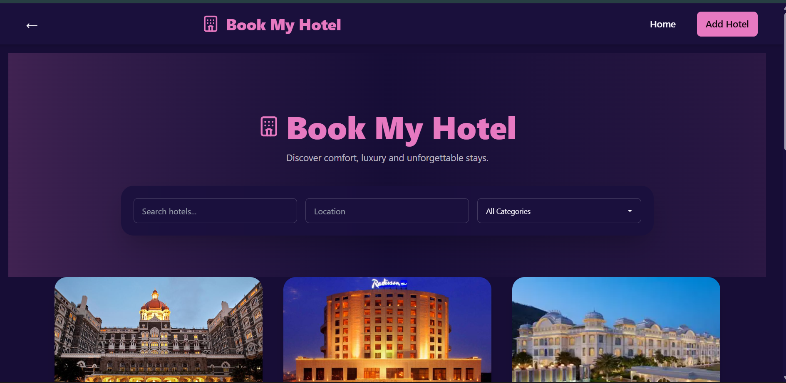
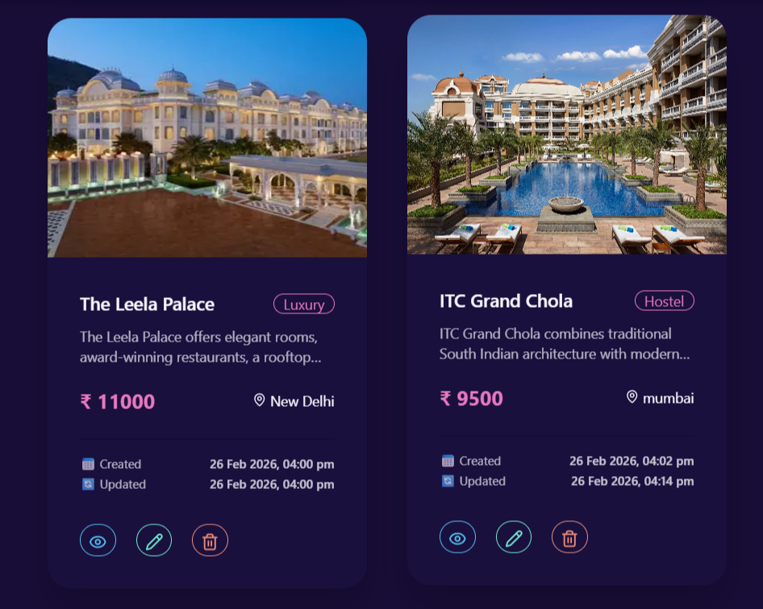
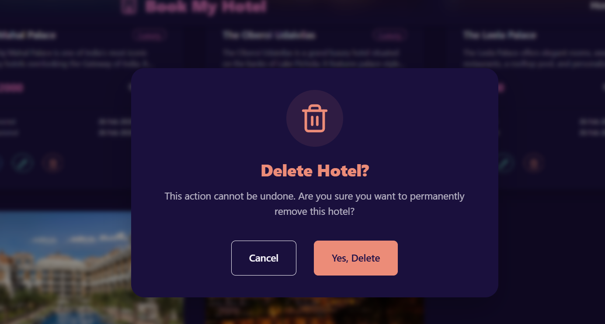
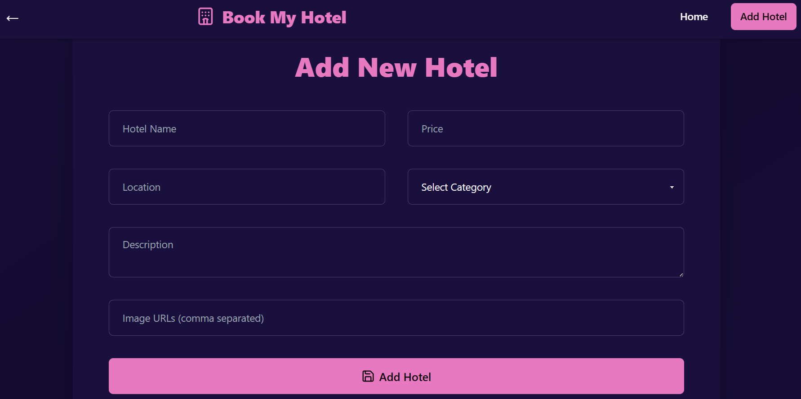
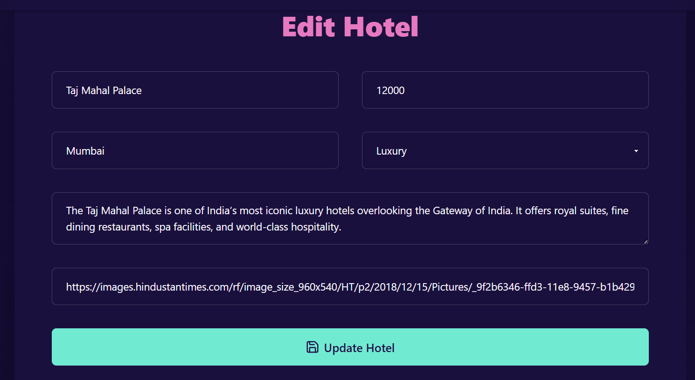
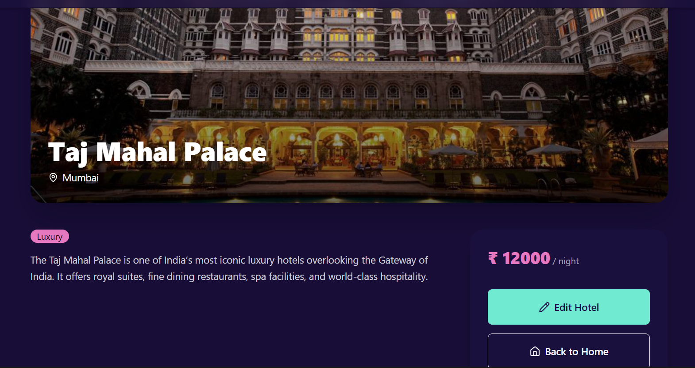

🏨 Book My Hotel
Full Stack MERN Hotel Management System
Developed by Khan Rashid (BSc Computer Science)

1️⃣ Project Introduction

Book My Hotel is a full-stack MERN application designed to manage hotel listings efficiently. The system allows users to create, view, update, delete, search, and filter hotels using a modern web interface connected to a RESTful API and MongoDB cloud database.

This project demonstrates complete integration between:

Frontend (React)

Backend (Node + Express)

Database (MongoDB Atlas)

Deployment (Render)

2️⃣ Complete System Architecture
User → React Frontend → Axios → Express API → Controller → Model → MongoDB Atlas
                                                           ↓
                                                        JSON Response
                                                           ↓
                                                     React UI Update

3️⃣ Application Flow (Step-by-Step)
🟢 Step 1: User Opens Website

React app loads.

Home.jsx renders.

useEffect() triggers API call.

GET /api/hotels is called.

Backend returns hotel data.

Hotels stored in React state.

Cards are rendered dynamically.

🟢 Step 2: User Searches or Filters

When user types:

Search input updates search state.

useEffect detects state change.

Debounced function waits 500ms.

API called with query parameters:

/api/hotels?search=value&location=value&category=value

Backend:

Applies regex filter.

Returns filtered results.

UI updates automatically.

🟢 Step 3: User Clicks View (👁)

Navigates to /hotel/:id

HotelDetails.jsx loads.

API GET /api/hotels/:id

Displays:

Large hero image

Title

Location

Description

Category

Price

🟢 Step 4: User Clicks Add Hotel

Navigates to /add

Form loads

User fills inputs

On submit:

POST /api/hotels

Toast success

Redirect to Home

🟢 Step 5: User Clicks Edit

Navigates to /edit/:id

Existing data fetched

Form pre-filled

On submit:

PUT /api/hotels/:id

Toast success

Redirect to Home

🟢 Step 6: User Clicks Delete

Modal opens

Confirmation required

On confirm:

DELETE /api/hotels/:id

Toast success

List refreshes

4️⃣ Detailed Frontend Explanation
🏠 Home.jsx (Core Page)
Responsibilities:

Fetch hotels

Manage search/filter state

Handle loading spinner

Render grid

Control Delete modal

Important States:
hotels        → Stores hotel list
search        → Title filter
location      → Location filter
category      → Category filter
loading       → Spinner control
selectedId    → Modal control
Why Debouncing?

Prevents excessive API calls when typing fast.

🏨 HotelCard.jsx

Reusable UI component.

Displays:

Image

Title

Category badge

Description

Price

Location

Created & Updated timestamps

Action buttons

Tooltips

Implemented using DaisyUI:

className="tooltip"
data-tip="View"
🗑 DeleteModal.jsx

Uses <dialog> element.

Features:

Confirmation UI

Async delete request

Toast notifications

List refresh

➕ AddHotel.jsx

Handles:

Controlled form inputs

Image URL parsing

POST request

Error handling

✏ EditHotel.jsx

Similar to AddHotel but:

Preloads existing data

Converts image array to comma string

PUT request

📄 HotelDetails.jsx

Advanced layout:

Hero image

Gradient overlay

Category badge

Price card

Navigation buttons

5️⃣ Backend Deep Explanation
server.js

Initializes Express

Loads environment variables

Connects database

Enables CORS

Registers route prefix

Starts server

hotelController.js

Contains full business logic.

Filtering Logic:
if (search) {
  query.title = { $regex: search, $options: "i" };
}

This allows case-insensitive searching.

Hotel.js (Schema Validation)

Uses Mongoose schema to:

Enforce required fields

Restrict category to enum

Auto-generate timestamps

Prevents invalid data entry.

6️⃣ State Management Strategy

React useState for local state

useEffect for side effects

Axios for HTTP

Controlled components for forms

No global state required due to project scale.

7️⃣ Error Handling Strategy

Frontend:

Try-catch around API calls

Toast error messages

Backend:

Try-catch in controllers

500 status on server error

404 on missing resource

8️⃣ UI Design Decisions

Tailwind for utility styling

DaisyUI for components

Forest theme for professional look

Synthwave as optional theme

Gradient hero for modern feel

Rounded cards for aesthetics

Hover animations for interactivity

9️⃣ Deployment Architecture

Backend:

Hosted on Render

Uses environment variables

Connects to MongoDB Atlas

Frontend:

Uses deployed API URL

Can be hosted on Vercel/Netlify

🔟 Performance Considerations

Debounced search

Efficient filtering via MongoDB

Component reusability

Lazy re-rendering

1️⃣1️⃣ Limitations

No authentication

No pagination

No image upload

No role-based control

1️⃣2️⃣ Future Scope

JWT Authentication

Admin dashboard

Booking system

Cloudinary image upload

Payment gateway

Reviews & ratings

Pagination

Advanced filters

1️⃣3️⃣ Learning Outcomes

This project demonstrates:

Full-stack MERN integration

REST API design

MVC backend architecture

MongoDB schema modeling

React routing & state management

Modern UI design principles

Cloud deployment strategy

Real-world CRUD implementation

👨‍💻 Author

Khan Rashid
BSc Computer Science Student
Full Stack MERN Developer
